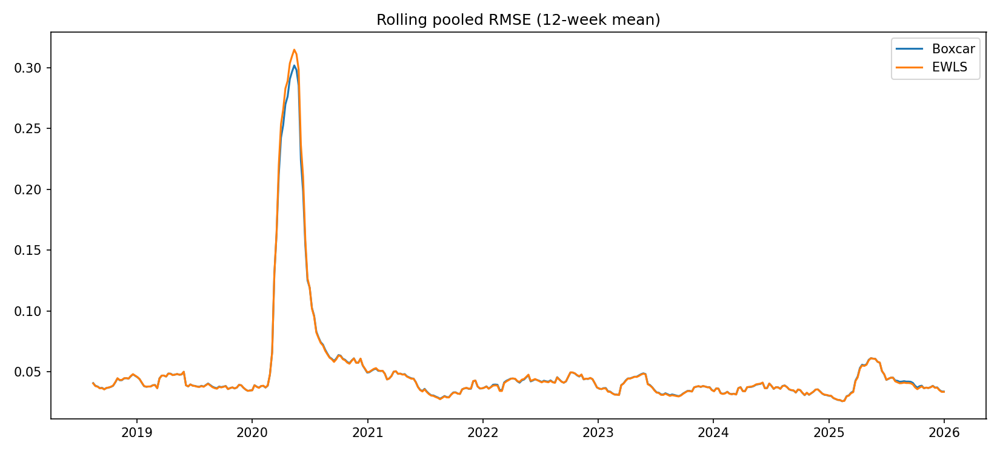
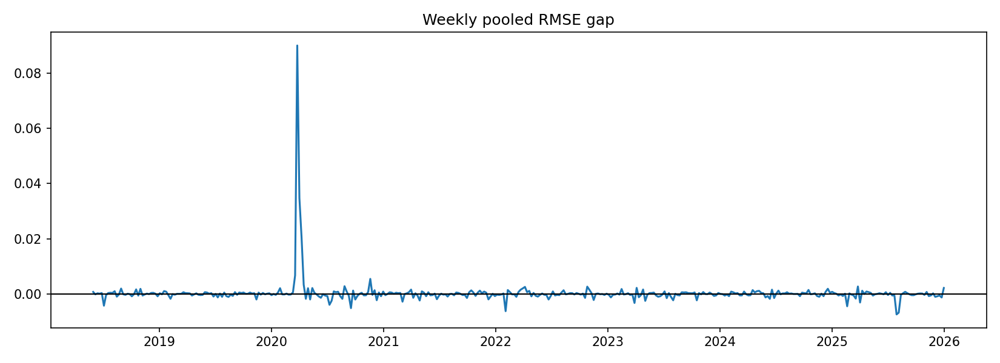
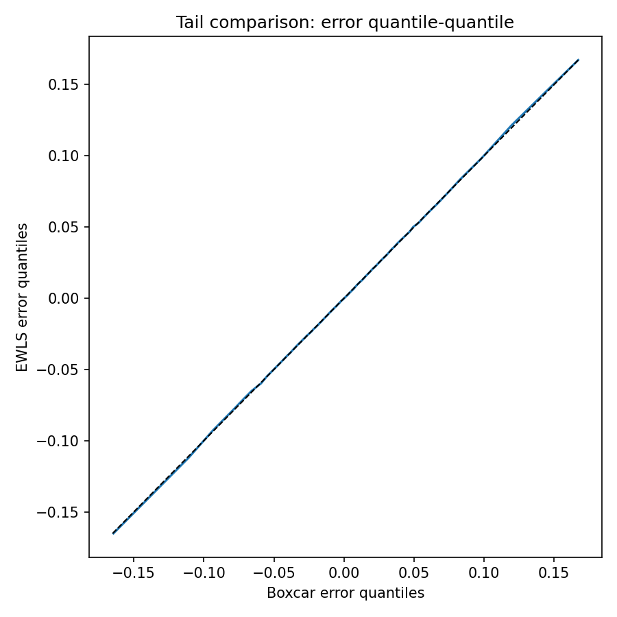
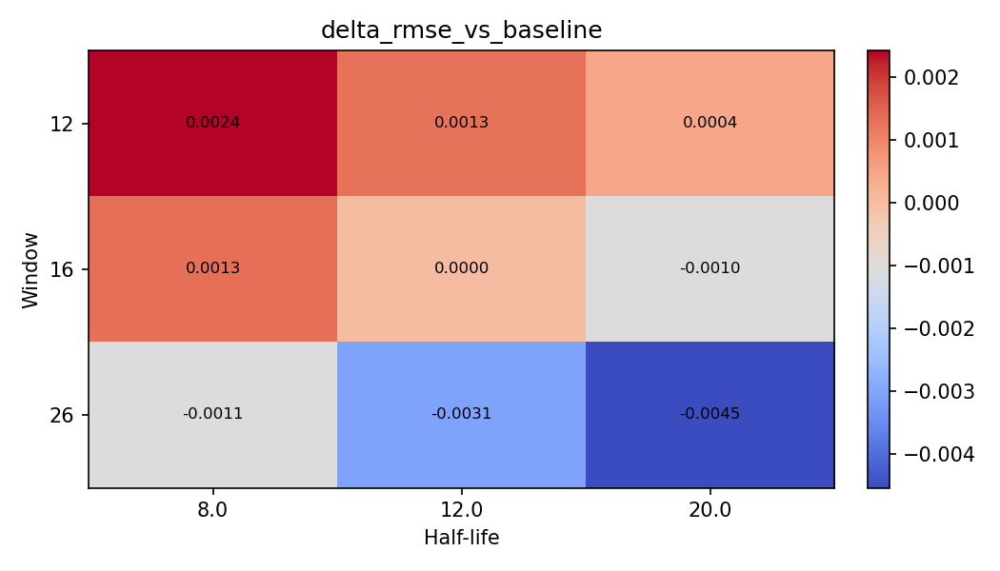
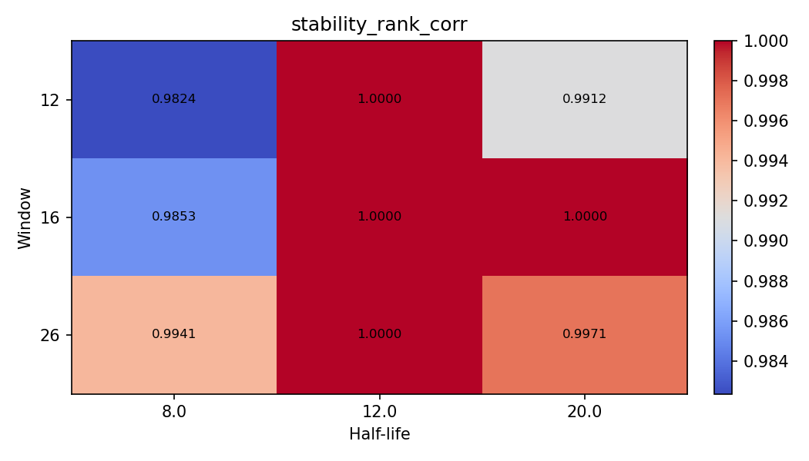

# HW5 Predictive Regression

**Methods, Results, and Robustness (Boxcar OLS vs Exponentially Weighted LS)**

## 1. Objective and required deliverables

This project implements the assignment’s two-stage framework:

1. **Construct weekly (Wednesday-to-Wednesday) return series** for:

   * Single-name **5Y CDS spreads** (treated as “prices” for percent returns),
   * Single-name **equity adjusted closes**,
   * **Market** returns via **SPY**.
2. **Contemporaneous (hedging) regressions** (rolling **boxcar OLS**, window (K=16)):

   * Equity CAPM: $r^{Equity}_{E,n} \sim m_n \to \gamma_{E,n}$
   * CDS model: $r^{CDS}_{E,n} \sim r^{Equity}*{E,n} + r^{Index}_n \to \beta^{(n)}_{E,Equity}, \beta^{(n)}_{E,Index}$
3. Build:

   * Hedge return: $f_{E,n}=\beta^{(n)}_{E,Equity}r^{Equity}_{E,n}+\beta^{(n)}_{E,Index}r^{Index}_n$
   * Hedged CDS residual: $\rho_{E,n}=r^{CDS}*{E,n}-f*{E,n}$
   * Residual equity return: $c_{E,n}=r^{Equity}*{E,n}-\gamma*{E,n}m_n$
4. **Predictive regression** (strict lag, no lookahead):
   $$
   \rho_{E,n} \sim c_{E,n-1}
   $$
   Compare:

   * **Boxcar OLS** (window 16),
   * **Exponentially weighted / discounted LS** (**half-life 12**; window 16).
     Form predictive residuals:
     $$
     q_{E,n}=\rho_{E,n}-\mu_{E,n-1}c_{E,n-1}
     $$
5. **Analysis**: compare performance across time (“events”), tail behavior, and statistical properties. No trading strategy required.

---

## 2. Data and construction

### 2.1 Instruments and sample

* **Tickers:** `AES, BA, C, F, GE, JPM, LNC, LOW, LUV, MAR, MCD, NFLX, T, WFC, WHR, XOM, XRX`
* **Frequency:** Weekly, anchored **Wednesday-to-Wednesday**, using the last available observation in each `W-WED` bin.
* **Sample range (weekly):** **2018-01-03** to **2025-12-31** (**397 weeks**).

### 2.2 Returns

* **Equity and SPY:** simple percent return on weekly adjusted close.
* **CDS “returns”:** simple percent return on weekly CDS parspread levels (treated like a price series as required).

### 2.3 CDS “Index return”

For each week (n):
[
r^{Index}*n=\frac{1}{N}\sum*{E=1}^N r^{CDS}_{E,n}
]

### 2.4 No-lookahead / strict lag alignment

All rolling regression coefficients used at week $n$ are estimated using **only prior weeks**, and the predictive residual definition uses $\mu_{n-1}$ and $c_{n-1}$ when forecasting $\rho_n$, matching the assignment’s indexing example. 

---

## 3. Model specification and estimation

### 3.1 Contemporaneous hedging regressions (boxcar OLS, (K=16))

For each ticker (E):

**Equity CAPM (rolling):**
$$
r^{Equity}*{E,n}\sim \gamma*{E,n} m_n
$$

**CDS contemporaneous model (rolling):**
$$
r^{CDS}*{E,n}\sim \beta^{(n)}*{E,Equity} r^{Equity}*{E,n}+\beta^{(n)}*{E,Index} r^{Index}_n
$$

### 3.2 Construct hedged series

$$
f_{E,n}=\beta^{(n)}*{E,Equity}r^{Equity}*{E,n}+\beta^{(n)}*{E,Index}r^{Index}*n
$$

$$
\rho*{E,n}=r^{CDS}*{E,n}-f_{E,n}
$$

$$
c_{E,n}=r^{Equity}*{E,n}-\gamma*{E,n}m_n
$$

### 3.3 Predictive regression (compare two estimators)

**Predictive model:**
$$
\rho_{E,n}\sim \mu_{E,n} c_{E,n-1}
$$

**Estimators compared:**

* **Boxcar OLS** (window 16, **no intercept** — consistent with the HW’s definitions of $f_{E,n}, c_{E,n}$, and $q_{E,n}$, which contain no constant term),
* **Exponentially weighted LS** (half-life 12; window 16; weights renormalized after NaN-masking; **no intercept** for the same reason).

**Intercept robustness check (not required by the HW):** I also reran the predictive regression with an intercept and confirmed conclusions were unchanged (Boxcar vs EWLS ranking and event/tail behavior).

**Predictive residuals:**
$$
q_{E,n}=\rho_{E,n}-\mu_{E,n-1}c_{E,n-1}
$$

---

## 4. Outputs produced

Generated artifacts (from `HW5_spine` run):

* `panel_results.csv` (full panel with $r^{CDS}, r^{Equity}, m, r^{Index}, \gamma, \beta, f, \rho, c, \mu, \hat\rho, q$)
* `metrics_per_ticker.csv`
* `metrics_pooled.csv`
* `event_windows.csv`
* Figures: `rolling_rmse.png`, `error_gap.png`, `tail_qq.png`
* Robustness: `robustness_sweep.csv`, `delta_rmse_heatmap.png`, `stability_heatmap.png`
  Interpretation scaffold: 

---

## 5. Core results (required comparison: Boxcar vs EWLS with half-life 12)

### 5.1 Pooled performance (all tickers pooled)

`metrics_pooled.csv` reports pooled summary statistics of predictive errors (q).

| model  |     rmse |    oos_r2 | rmse_delta_vs_boxcar | oos_r2_delta_vs_boxcar |       q01 |       q05 |      q95 |      q99 |     skew |   kurtosis |           n |
| :----- | -------: | --------: | -------------------: | ---------------------: | --------: | --------: | -------: | -------: | -------: | ---------: | ----------: |
| boxcar | 0.078726 | -0.241570 |             0.000000 |               0.000000 | -0.164503 | -0.071141 | 0.074031 | 0.167206 | 1.655034 | 216.677998 | 6274.000000 |
| ew     | 0.081275 | -0.323290 |             0.002550 |              -0.081720 | -0.165086 | -0.070221 | 0.073929 | 0.167253 | 0.421885 | 229.927242 | 6274.000000 |

**Key pooled findings (assignment setting: window 16, half-life 12):**

* **Boxcar OLS has lower pooled RMSE** than EWLS by **0.00255**.
* EWLS has **more negative** pooled out-of-sample (R^2) (delta **−0.0817**).
* **Tail quantiles are very similar** at pooled level (q01/q99 are nearly identical), while **shape** differs:

  * EWLS error distribution exhibits **lower skew** but **higher kurtosis**.

### 5.2 Weekly “event” behavior (historical windows of divergence)

Define weekly pooled RMSE for each method as:
$$
RMSE_n=\sqrt{\mathbb{E}*E[q*{E,n}^2]}
$$
and analyze the weekly gap $RMSE^{EW}_n-RMSE^{Box}_n$.

Across **397** weeks:

* Fraction of weeks EWLS is better (gap < 0): **47.85%**
* Fraction of weeks Boxcar is better (gap > 0): **47.13%**
* Mean gap: **+0.000255** (EWLS slightly worse on average)
* Mean gap excluding the single worst week: **+0.000028** (nearly zero)
* Largest EWLS underperformance week gap: **+0.09001**
* Largest EWLS outperformance week gap: **−0.00745**

**Largest EWLS underperformance windows (EW − Box):**

| date       | rmse_boxcar |  rmse_ew | gap_ew_minus_boxcar |
| :--------- | ----------: | -------: | ------------------: |
| 2020-03-25 |    0.607955 | 0.697966 |            0.090011 |
| 2020-04-01 |    0.436777 | 0.471505 |            0.034728 |
| 2020-04-08 |    0.158247 | 0.178788 |            0.020541 |
| 2020-03-18 |    0.421010 | 0.427715 |            0.006705 |
| 2020-11-18 |    0.058870 | 0.064301 |            0.005431 |

**Largest EWLS outperformance windows (EW − Box):**

| date       | rmse_boxcar |  rmse_ew | gap_ew_minus_boxcar |
| :--------- | ----------: | -------: | ------------------: |
| 2025-07-30 |    0.044290 | 0.036841 |           -0.007449 |
| 2025-08-06 |    0.044477 | 0.037674 |           -0.006804 |
| 2022-02-02 |    0.059398 | 0.053129 |           -0.006269 |
| 2020-09-16 |    0.064941 | 0.059771 |           -0.005170 |
| 2025-02-19 |    0.031439 | 0.026944 |           -0.004495 |

**Interpretation:** The most material divergence occurs during **March–April 2020**, where EWLS performs substantially worse than boxcar. Outside such stress windows, differences are typically small and frequently switch sign.

### 5.3 Tail behavior (required: “How are the tails?”)

* Pooled q01/q99 are extremely close between methods (Section 5.1).
* The **tail QQ plot** indicates near one-for-one mapping between quantiles of EWLS and boxcar errors (i.e., tail behavior is broadly similar in quantile space), while higher moments differ (skew/kurtosis).

---

## 6. Per-ticker results (required granularity)

Table below reports per-ticker RMSE and OOS (R^2) for both estimators and the RMSE difference (EW − Box). (GE did not produce valid metrics in the output; NFLX has fewer observations.)

| Ticker | RMSE_Boxcar | RMSE_EWLS | ΔRMSE (EW-Box) | OOS_R2_Boxcar | OOS_R2_EWLS |   n |
| :----- | ----------: | --------: | -------------: | ------------: | ----------: | --: |
| AES    |    0.104287 |  0.113920 |       0.009633 |     -2.415728 |   -3.075912 | 397 |
| BA     |    0.171197 |  0.179530 |       0.008333 |     -0.322178 |   -0.454023 | 397 |
| C      |    0.044975 |  0.045745 |       0.000770 |     -0.158383 |   -0.198373 | 397 |
| F      |    0.069517 |  0.071609 |       0.002092 |     -0.110431 |   -0.178271 | 397 |
| GE     |         NaN |       NaN |            NaN |           NaN |         NaN | NaN |
| JPM    |    0.044125 |  0.045037 |       0.000911 |     -0.105452 |   -0.151587 | 397 |
| LNC    |    0.069537 |  0.070061 |       0.000524 |     -0.222138 |   -0.240640 | 397 |
| LOW    |    0.060457 |  0.060468 |       0.000011 |      0.009579 |    0.009204 | 397 |
| LUV    |    0.108622 |  0.108906 |       0.000284 |      0.031867 |    0.026801 | 397 |
| MAR    |    0.074054 |  0.076521 |       0.002467 |     -0.157370 |   -0.235774 | 397 |
| MCD    |    0.062312 |  0.066005 |       0.003693 |     -0.367048 |   -0.533878 | 397 |
| NFLX   |    0.066239 |  0.065716 |      -0.000523 |     -0.104937 |   -0.087569 | 319 |
| T      |    0.036987 |  0.037505 |       0.000518 |     -0.104770 |   -0.135955 | 397 |
| WFC    |    0.049330 |  0.049928 |       0.000599 |     -0.111594 |   -0.138739 | 397 |
| WHR    |    0.051731 |  0.051760 |       0.000029 |     -0.035720 |   -0.036882 | 397 |
| XOM    |    0.053945 |  0.053995 |       0.000051 |     -0.036471 |   -0.038413 | 397 |
| XRX    |    0.079938 |  0.079581 |      -0.000357 |     -0.036557 |   -0.027322 | 397 |

**Per-ticker summary:**

* EWLS (half-life 12) improves RMSE for **2/16** tickers with valid comparisons (**NFLX**, **XRX**), is roughly neutral for a few (e.g., LOW), and is worse for most tickers.
* The largest EWLS deterioration is in **AES** and **BA** (RMSE deltas (\approx) 0.008–0.010).
* **GE** metrics are missing in the provided output (diagnosis should be tied to missingness / alignment in the underlying time series for that ticker).

---

## 7. Statistical properties: what differs between estimators?

Based on pooled error distributions (Section 5.1):

* **Location/scale:** Similar mean and standard deviation; boxcar has slightly smaller RMSE.
* **Tails (quantiles):** q01/q99 are nearly identical between methods.
* **Shape:** EWLS produces **substantially lower skew** but **higher kurtosis**.

Interpretation consistent with time-local behavior:

* EWLS can track changes more rapidly but may be **more fragile in abrupt regime shifts**, as reflected by the large March–April 2020 spike in the weekly RMSE gap.

---

## 8. Above-and-beyond (explicitly noted)

### 8.1 Robustness / sensitivity sweep (not required by assignment)

A sensitivity analysis was run over:

* Predictive windows: **{12, 16, 26}**
* EWLS half-lives: **{8, 12, 20}**

Results (`robustness_sweep.csv`) show:

* Baseline (assignment EWLS): **window 16, half-life 12**, RMSE = **0.081275**
* Best-performing EWLS configuration in the sweep:

  * **window 26, half-life 20**, RMSE = **0.076734**
  * This improves RMSE by **0.004541** versus the baseline EWLS setting
  * And is **0.00199 lower** than boxcar’s pooled RMSE (**0.078726**)

Stability (ticker-ranking correlation of RMSE deltas) is consistently high (**~0.98–1.00**), indicating that relative ticker impacts of parameter changes are stable.

**Full sweep table (EWLS only):**

| window | half_life |  ew_rmse | ew_oos_r2 | delta_rmse_vs_baseline | delta_r2_vs_baseline | stability_rank_corr |
| -----: | --------: | -------: | --------: | ---------------------: | -------------------: | ------------------: |
|     12 |       8.0 | 0.083703 | -0.403537 |               0.002428 |            -0.080247 |            0.982353 |
|     12 |      12.0 | 0.082573 | -0.365878 |               0.001297 |            -0.042587 |            1.000000 |
|     12 |      20.0 | 0.081710 | -0.337479 |               0.000435 |            -0.014189 |            0.991176 |
|     16 |       8.0 | 0.082601 | -0.366819 |               0.001326 |            -0.043528 |            0.985294 |
|     16 |      12.0 | 0.081275 | -0.323290 |               0.000000 |             0.000000 |            1.000000 |
|     16 |      20.0 | 0.080237 | -0.289702 |              -0.001038 |             0.033588 |            1.000000 |
|     26 |       8.0 | 0.080206 | -0.274193 |              -0.001069 |             0.049097 |            0.994118 |
|     26 |      12.0 | 0.078223 | -0.211971 |              -0.003052 |             0.111319 |            1.000000 |
|     26 |      20.0 | 0.076734 | -0.166268 |              -0.004541 |             0.157022 |            0.997059 |

**Takeaway:** Under the assignment’s fixed half-life (12), EWLS is slightly worse than boxcar in pooled RMSE; however, **stronger smoothing** (longer window and longer half-life) can materially improve EWLS and even outperform boxcar in this dataset.

---

## 9. Figures (placeholders for insertion)

Insert the generated figures below (filenames correspond to the run outputs):

### Figure 1 — Rolling pooled RMSE (12-week mean)

### Figure 2 — Weekly pooled RMSE gap (EWLS − Boxcar)

### Figure 3 — Tail comparison (error quantile–quantile)

### Figure 4 — Robustness sweep: ΔRMSE vs baseline (EWLS)

### Figure 5 — Robustness sweep: stability (rank correlation)

---

## 10. Reproducibility and audit trail

* The complete computation (data → weekly construction → rolling regressions → predictive regression → outputs) is executed in `HW5_spine.ipynb`.
* The full panel used to compute all summary tables/plots is stored in `panel_results.csv`, enabling direct verification of:

  * Weekly series construction $r^{CDS}, r^{Equity}, m, r^{Index}$,
  * Rolling coefficients $\gamma, \beta$,
  * Hedged residuals $\rho$ and residual equity returns $c$,
  * Predictive coefficients $\mu$ and predictive residuals $q$.

---

## Output files and notes:

* `metrics_pooled.csv`
* `metrics_per_ticker.csv`
* `event_windows.csv`
* `robustness_sweep.csv`
* `panel_results.csv`
* Figures: `rolling_rmse.png`, `error_gap.png`, `tail_qq.png`, `delta_rmse_heatmap.png`, `stability_heatmap.png`

* The assignment comparison is performed exactly at **window 16** and **EWLS half-life 12**; alternative EWLS smoothness settings materially change conclusions (Section 8).
* Some tickers may have incomplete aligned histories (e.g., **GE** metrics missing; **NFLX** has fewer observations), which affects pooled counts and per-ticker comparability.
